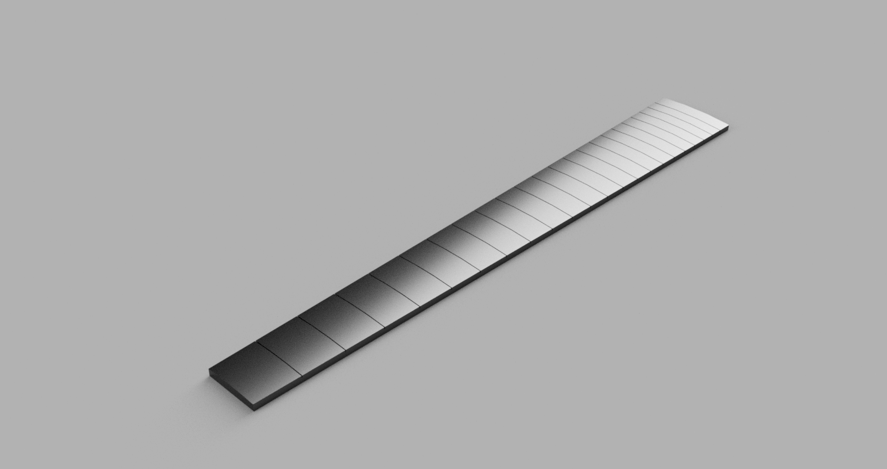

# Fretboard

Fretboard is a parametric guitar fretboard generator focused on producing a scripted STEP export for manufacturing and CAD workflows.

The current project generates a real STEP model, writes output artifacts to a work folder, supports built-in and user presets, and exposes both a CLI workflow and a Streamlit UI.

The project is at `1.0 alpha`. Exported STEP files still require human-in-the-loop visual validation until an automated geometry-validation method is in place.



## Quick Start

Create a local virtual environment, then install the project into that environment in editable mode.

```powershell
py -3.11 -m venv .venv
.\.venv\Scripts\python.exe -m pip install -e .[ui,dev]
```

Or use the helper script, which assumes `.venv` already exists and installs the default `ui` and `dev` extras:

```powershell
.\scripts\setup_env.ps1
```

That setup makes the package importable from the repo checkout, keeps the environment isolated, and avoids relying on `PYTHONPATH`.

## Current Capabilities

- Versioned JSON presets with built-in and user-defined entries
- Internal geometric calculations in millimeters with user-facing inch or millimeter display units
- Preset-driven parameter editing with save-as user preset support
- Scripted STEP generation through a `build123d` backend
- Dot inlay recess generation with alpha fallback from non-dot preset styles
- Sidecar JSON manifest written alongside each generated STEP file
- Streamlit UI for preset selection, parameter editing, unit switching, and generation
- CLI commands for listing presets, saving user presets, and generating output

## Project Structure

```text
docs/       Design and architecture documents and tracked images for the README
presets/    Built-in and user preset data
references/ Historical reference assets
src/        Application package
tests/      Behavioral and backend tests
scripts/    Helper scripts for setup, launch, and inspection
artifacts/  Generated output when using the default local launch setup
```

## Presets

Presets live in [presets.json](C:/Data/dev/fretboard/presets/presets.json). User presets are stored separately in `presets/user_presets.json` when saved through the app.

Each preset record contains:

- `id`
- `name`
- `units`
- `geometry`
- `metadata`

Preset `units` are treated as preferred display units. Internally, all geometry is converted to millimeters.

## Output

The generator writes:

- a `.step` file for the fretboard solid
- a `.fretboard.json` sidecar manifest with the resolved parameters and summary data

STEP output is not yet considered self-validating. For `1.0 alpha`, exported geometry should still be reviewed by a human before being treated as manufacturing-ready.

By default, output is written to the active work folder.

The work folder can be controlled by:

- CLI option: `--work-folder`
- environment variable: `FRETBOARD_WORK_FOLDER`
- current working directory when neither is provided

## CLI Usage

After editable install, you can use either the module form or the packaged console command.

List presets:

```powershell
fretboard list-presets
```

Or through the helper wrapper:

```powershell
.\scripts\run_cli.ps1 list-presets
```

Save a modified preset as a user preset:

```powershell
fretboard save-preset --preset gibson_les_paul --units mm --scale-length 635 --save-preset-name "Workshop LP"
```

Generate a STEP file into a work folder:

```powershell
fretboard generate --preset gibson_les_paul --work-folder artifacts
```

Generate with overrides:

```powershell
fretboard generate --preset gibson_les_paul --units mm --num-frets 24 --scale-length 635 --work-folder artifacts
```

## Streamlit UI

The current UI is implemented in [streamlit_app.py](C:/Data/dev/fretboard/src/fretboard/ui/streamlit_app.py).

Launch it with:

```powershell
.\scripts\run_ui.ps1
```

Or directly:

```powershell
.\.venv\Scripts\streamlit.exe run .\src\fretboard\ui\streamlit_app.py
```

The UI supports:

- selecting a preset from a dropdown
- preloading all editable parameters from the selected preset
- switching display units between inches and millimeters with numeric conversion
- editing any current geometry or metadata field
- saving the current values as a user preset
- generating a STEP file into the resolved work folder

## CAD Backend

The current STEP backend uses `build123d`.

The baseline modeling sequence is:

1. create an oversize rectangular blank
2. form the cylindrical fretboard crown on that blank
3. cut fret slots on the pre-trim body
4. trim the slotted blank to the final tapered outline
5. cut dot inlay recesses into the fretboard top face
6. export the result to STEP

For `1.0 alpha`, any preset `inlay_style` currently resolves to the dot inlay path during CAD generation.

This matches the current design direction documented in [design_requirements.md](C:/Data/dev/fretboard/docs/design_requirements.md).

## Attribution

This project was originally informed by `fretfind.js` for fret-position calculation ideas and reference behavior. The current codebase, architecture, preset model, UI workflow, unit-handling system, and CAD generation pipeline are independently structured and substantially reworked.

The historical reference file is kept at [fretfind.js](C:/Data/dev/fretboard/references/fretfind.js).

## Development

Run tests with the helper script:

```powershell
.\scripts\run_tests.ps1
```

Or directly through the repo-local Python:

```powershell
.\.venv\Scripts\python.exe -m pytest tests -p no:cacheprovider
```

VS Code launch configurations are provided for:

- CLI generation
- Streamlit UI
- test execution


